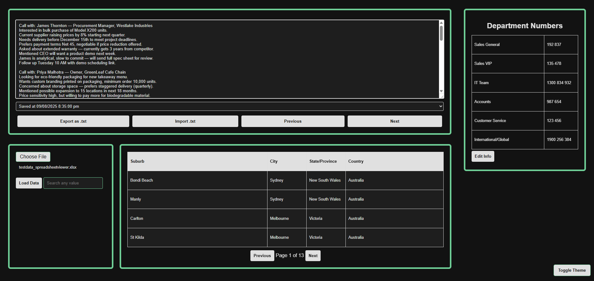

# 📊 Spreadsheet Viewer & Search Tool  

A fast, themeable, client-side web tool for viewing, searching, and working with spreadsheet data — entirely in your browser.  
Originally built as a lightweight offline utility for quickly exploring Excel data without installing heavy spreadsheet software.  

---

## 🚀 Features  

- 📂 Load `.xlsx` spreadsheets (via drag-and-drop or file input)  
- 🏷️ Dynamically render column headers and rows  
- 🔍 Global search across all cells  
- ↕️ Sort columns by clicking headers (ascending/descending)  
- ⌨️ **Keyboard shortcuts**:  
  - **Enter**: Load spreadsheet  
  - **← / →**: Paginate results  
  - **/**: Focus search bar  
- 📑 Paginated results with smooth table layout  
- 🎨 Theme toggle (light/dark) with persistent user preference  
- 📝 Personal notepad with:  
  - Autosave and version history  
  - Export to `.txt`  
  - Import/restore from `.txt`  
- 📱 Mobile-responsive UI with hover interaction for better accessibility  
- ⚡ Works entirely offline — no backend required  

---

## 💡 Why I Built This  

I wanted a quick way to open, search, and explore Excel spreadsheets without relying on slow desktop applications or cloud tools.  
By keeping it lightweight, offline, and responsive, I could run it instantly in any browser without setup.  

**Key design constraints:**  
- **No backend:** Everything runs locally for privacy and portability.  
- **Lightweight:** Minimal dependencies for fast load times.  
- **Accessible:** Works on desktop and mobile, keyboard and mouse.  

<br>

---

## 🛠️ Challenges & Solutions  

| Challenge | Solution |
|-----------|----------|
| Theme kept resetting to dark mode after editing the Department Numbers section. | Fixed by saving the theme preference to `localStorage` immediately on toggle, and reading it on page load before CSS renders to avoid flicker. |
| Uploaded spreadsheets sometimes displayed blank rows at the bottom. | Added a check to strip trailing empty rows when parsing the sheet with SheetJS. |
| Clicking “Load Data” on a large Excel file froze the interface. | Moved the file parsing to a Web Worker and displayed a loading spinner until data was ready. |
| Pagination showed “Page 0” if a filter removed all rows. | Added logic to clamp `currentPage` to a minimum of 1 and gracefully display “No results found” instead of an empty table. |
| Imported `.txt` files for the notepad sometimes overwrote current notes by accident. | Added a confirmation prompt before replacing existing notes when importing a file. |

<br>

---

## 🖼️ Screenshots  

> Screenshots are stored in the `images/` folder.  

### 🏠 Main Viewer  
  

<br>

---

## 🛠️ Tech Stack  

- **HTML, CSS** (custom theme variables)  
- **JavaScript (ES6 Modules)**  
- **[SheetJS](https://sheetjs.com/)** to parse Excel files  
- No frameworks — fully vanilla  
- Works entirely offline in the browser  

<br>

---

## 📁 Folder Structure  

```bash
📁 spreadsheet-viewer/
├── index.html
├── styles.css
├── js/
│   ├── excel.js
│   ├── main.js
│   ├── notepad.js
│   └── table.js
└── README.md
```

<br>

---

## 🔮 Future Improvements  

- 🖌️ **Bulk Row/Column Operations** – Select multiple rows/columns and apply formatting or actions.  
- 🎨 **Expanded Theme Options** – More color schemes or a custom color picker.  
- ⌨️ **Custom Keyboard Shortcuts** – Allow users to rebind keys for faster navigation.  
- 📊 **Column Filters** – Filter rows based on specific column values.  
- 📦 **CSV Export** – Save filtered or sorted data as `.csv`.  
- 🛠️ **Advanced Search** – Search by regex, case sensitivity, or exact match.  

<br>

---

## 📦 Installation & Usage

1. Clone the repository:  
   ```bash
   git clone https://github.com/yourusername/spreadsheet-viewer.git
   ```
2. Open `index.html` in your browser (no server required).  
3. Load a spreadsheet via drag-and-drop or file input, then search, sort, and navigate as needed.  

<br>

---

## 💻 Demo  

<br>

Try it here: [Spreadsheet Viewer & Search Tool](https://bradflavel.github.io/spreadsheet-viewer/)

<br>

---

## 📝 License  

MIT License  

Permission is hereby granted, free of charge, to any person obtaining a copy  
of this software and associated documentation files (the "Software"), to deal  
in the Software without restriction, including without limitation the rights  
to use, copy, modify, merge, publish, distribute, sublicense, and/or sell  
copies of the Software, and to permit persons to whom the Software is  
furnished to do so, subject to the following conditions:  

The above copyright notice and this permission notice shall be included in  
all copies or substantial portions of the Software.  

THE SOFTWARE IS PROVIDED "AS IS", WITHOUT WARRANTY OF ANY KIND, EXPRESS OR  
IMPLIED, INCLUDING BUT NOT LIMITED TO THE WARRANTIES OF MERCHANTABILITY,  
FITNESS FOR A PARTICULAR PURPOSE AND NONINFRINGEMENT. IN NO EVENT SHALL THE  
AUTHORS OR COPYRIGHT HOLDERS BE LIABLE FOR ANY CLAIM, DAMAGES OR OTHER  
LIABILITY, WHETHER IN AN ACTION OF CONTRACT, TORT OR OTHERWISE, ARISING FROM,  
OUT OF OR IN CONNECTION WITH THE SOFTWARE OR THE USE OR OTHER DEALINGS IN  
THE SOFTWARE.  

<br>

---

## 🙋 Contact  

Questions? Reach out via [LinkedIn](https://www.linkedin.com/in/brad-f-643079b5).  
